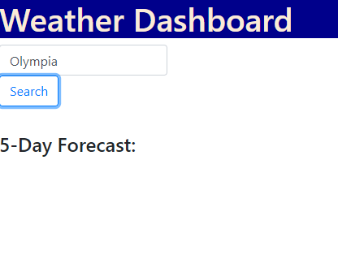

# 5 Day Weather Forecast

## Description

My goal for this project was to build a web app that would receive the user input for a city and then generate a 5 day forecast of the weather for that city. I built this project to put into practice the use of web APIs, local storage, html, css, and javascript. This project is a work in progress.

## Usage

Input a city into the search bar and receive a 5 day weather forecast for that city.

## License

MIT license